# Nuvepro-Spring-Data-Jpa
## Create the Item
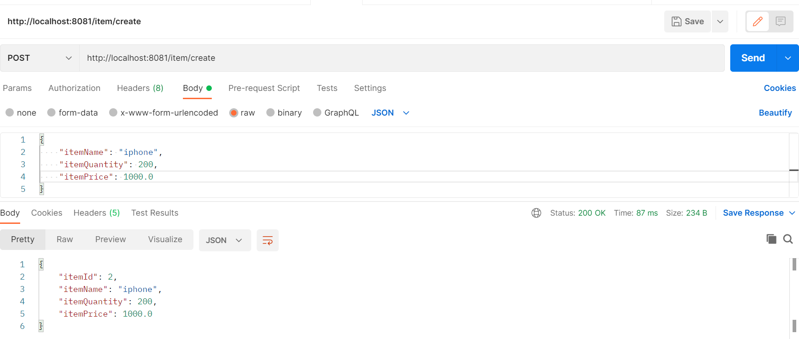  
## Get the Items
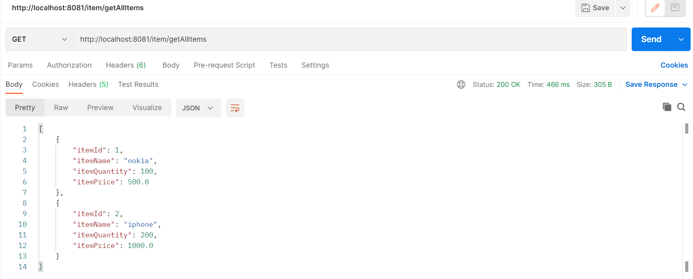  
## Item Table
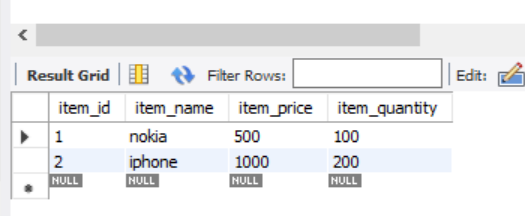  
## Create the Order
## Create the Order with more than item quantity
  
## Create the Order with not found item
  
## Create the Order correctly by a specific user
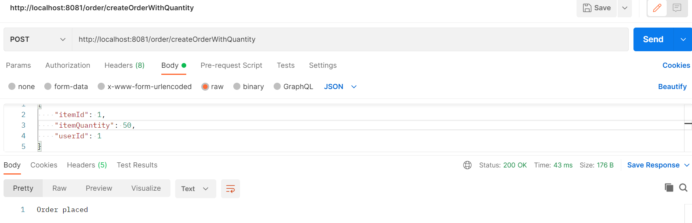  
## Blocked the Order when that is already placed and not enough quantity to order request user
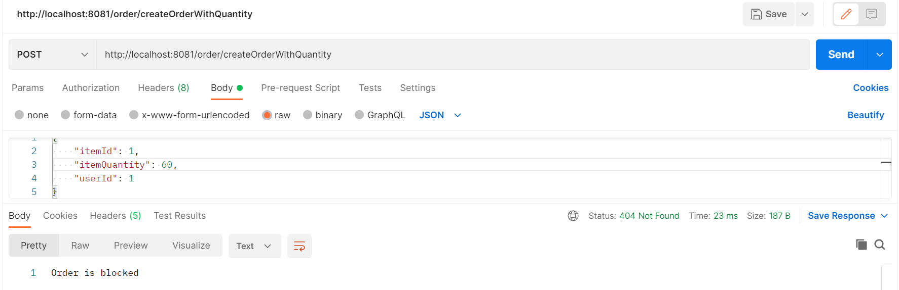  
## Get all the orders
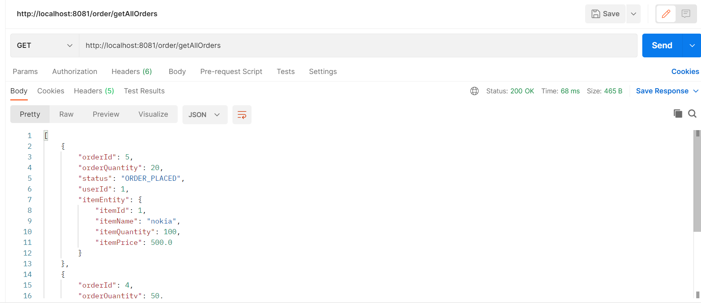 
## Get all the orders for a specific user
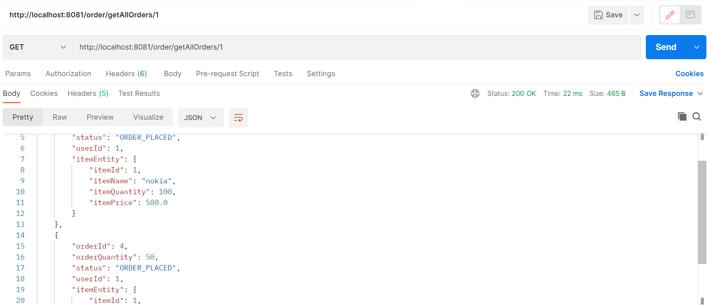  
## Accept the Order
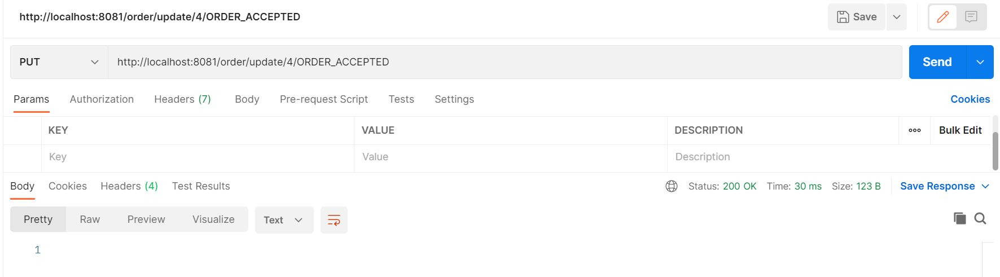 
## Order Table
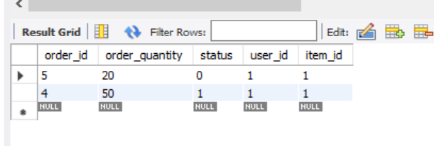 
# Setting Up Swagger 2 with a Spring REST API Using Springfox
## Swagger UI url: http://localhost:8081/swagger-ui/
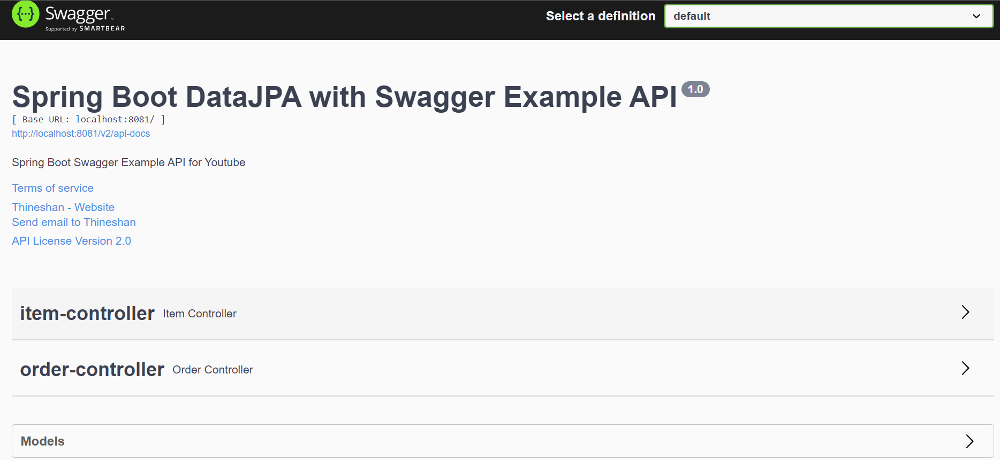 
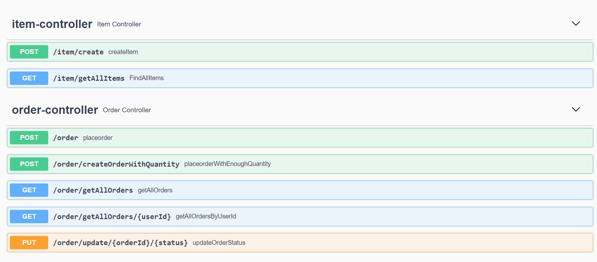 
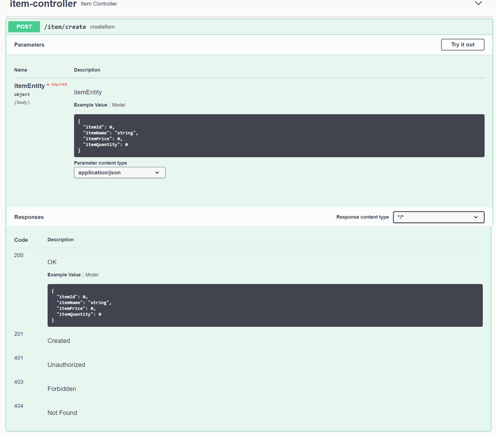 
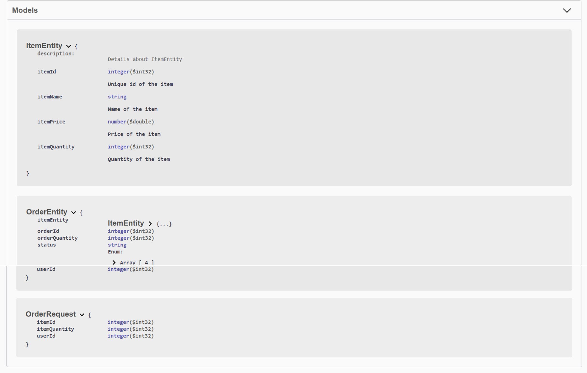 
